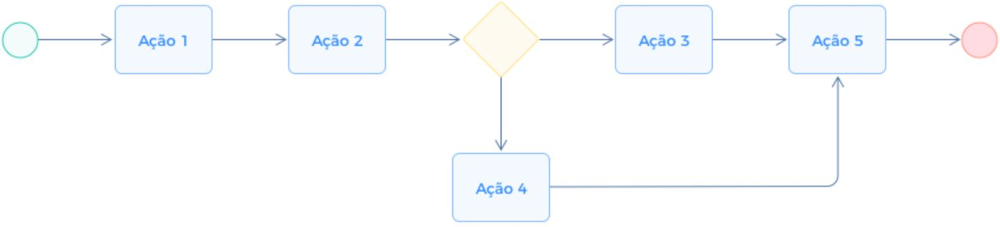

# Projeto de Interface

## Diagrama de Fluxo

O diagrama apresenta o estudo do fluxo de interação do usuário com o sistema interativo e  muitas vezes sem a necessidade do desenho do design das telas da interface. Isso permite que o design das interações seja bem planejado e gere impacto na qualidade no design do wireframe interativo que será desenvolvido logo em seguida.

O diagrama de fluxo pode ser desenvolvido com “boxes” que possuem internamente a indicação dos principais elementos de interface - tais como menus e acessos - e funcionalidades, tais como editar, pesquisar, filtrar, configurar - e a conexão entre esses boxes a partir do processo de interação. Você pode ver mais explicações e exemplos https://www.lucidchart.com/blog/how-to-make-a-user-flow-diagram.

As referências abaixo irão auxiliá-lo na geração do artefato “Diagramas de Fluxo”.

> **Links Úteis**:
> - [Fluxograma online: seis sites para fazer gráfico sem instalar nada | Produtividade | TechTudo](https://www.techtudo.com.br/listas/2019/03/fluxograma-online-seis-sites-para-fazer-grafico-sem-instalar-nada.ghtml)

## Wireframes
<h3><b>Tela - Login</b></h3>

Tela de login apresenta os campos de "nome de usuario" e "senha" para caso o usuario ja tenha cadastro no site so preencha essas credenciais,caso ele nao tenha e possivel criar um registro clincando na frase" Não conseguir iniciar sessão?Criar conta" 

  

<figure> 
  <figcaption>Figura 1 - Tela home page
</figure> 

<h3><b>Tela - Login e Registre-se</b></h3>

Tela de login e registre-se, ao clicar no primeiro icone será  aberto um pop up aonde o usario poderá fazer login caso ja tenha conta ou se registrar no site caso não tenha.

 
  
<figure> 
  <figcaption> Figura 4 - Login e Registre-se
</figure> 

<h3><b>Tela - Lista de amigos</b></h3>

Tela de lista de amigos, clicando no segundo icone o pop up da tela de amigos será aberto aonde o usuario podera ver seus amigos adicionados.

  
<figure>  
    <figcaption>Figura 5 - Tela de lista de amigos     
</figure> 

<h3><b>Tela – Adicionar Amigos</b></h3>

Tela adicionar amigos, dentro do pop up lista de amigos tem um icone com um + aonde clicando o usuario conseguira buscar outro usuario atraves do nickname e o adiciona-lo a lista de amigos. 

  

<figure> 
    <figcaption>Figura 6 - Tela de Adicionar Amigos
</figure>

<h3><b>Tela – Perfil</b></h3>

Tela perfil, la o usuario será capaz de adicionar ou alterar informações de seu perfil.

